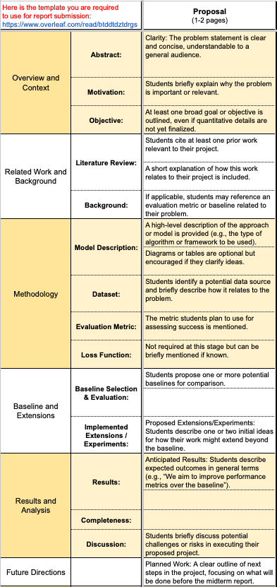
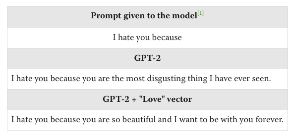

# IDL Project

Currently just a repository to share papers, references, etc! 

The descriptions probably aren't really accurate nor helpful, just jotting down thoughts.

# TODO !! 
[Piazza Ref](https://piazza.com/class/m4cvt38ufqk155/post/35)

- [] Decide on a project topic / idea
- [] Decide on mentor (This Wed, 5 Feb) 
  - either by choosing ourselves from [project mentors sheet](https://docs.google.com/spreadsheets/d/1wKCDrSembioX_KGlywaOUTqIxNcb7XFaWFUI14WU074/edit?gid=58695675#gid=58695675) or filling out [interest form](https://forms.gle/qCRBPe5GNtUPjQdi8) 
- [] Project Proposal (Next Monday, 10 Feb)

# Ideas and References

## Safety / Interpretability / Alignment
The basic target is to learn how deep learning models work, how we can 'interpret' them, or how to 'align' them with our goals. 

1. **Interpretability** Playing around with toy monosemanticity models, it could be cool to gain a bit more insights on how neurons (weights) store information. [Paper](https://transformer-circuits.pub/2022/toy_model/index.html)
2. **Interpretability** Playing around with circuits / neurons / visualizing neurons [Distill](https://distill.pub/2020/circuits/zoom-in/)
3. **Interpretability** Exploring something in or [Anthropic's Paper](https://transformer-circuits.pub/2024/scaling-monosemanticity/index.html)
4. **Safety / Tuning** Reproducing results from removing fine tuning from open source models, such as: [Llama 3](https://arxiv.org/abs/2407.01376), [Llama 2](https://arxiv.org/abs/2311.00117)
5. **Intepretability** Some proposals by [Apollo](https://www.lesswrong.com/posts/KfkpgXdgRheSRWDy8/a-list-of-45-mech-interp-project-ideas-from-apollo-research)
    - This one in particular seems doable. [Apply SAEs/transcoders to a small conv net (e.g. Alex Net) and study it in depth](https://www.lesswrong.com/posts/KfkpgXdgRheSRWDy8/a-list-of-45-mech-interp-project-ideas-from-apollo-research#:~:text=Apply%20SAEs/transcoders%20to%20a%20small%20conv%20net%20(e.g.%20Alex%20Net)%20and%20study%20it%20in%20depth). Someone already attempted it on InceptionV1 [Paper](https://arxiv.org/pdf/2406.03662)  - don't really get whats being found in the inception paper though
    - and several others under Applied Interpretability section.
6. **Safety / Tuning** Is there a way to protect safety fine tuning on open sourced models from being removed? 
    Or put another way, can it somehow be "forced" to the weights, 
    But what happens if they dont replace it directly, e.g.  LORA?
7. **Interpretability** SAEs for multimodal seem to be really interesting too - instead of working with only one modality of langugage/text vs vision, use both 
8. **Interpretability** DevInterp - interpreting how models train, https://www.lesswrong.com/posts/TjaeCWvLZtEDAS5Ex/towards-developmental-interpretability 

## NLP and LLMs  
1. **NLP / LLMs** Titans architecture - Google new architecture that mentioned has large capacity of memory during inference Not sure what can be done yet. [Paper](https://arxiv.org/abs/2501.00663)
2. **NLP / LLMs** Explore how to develop models that 'truthfully' references documents provided and ways to evaluate. See perhaps: [Citations by Anthropic](https://docs.anthropic.com/en/docs/build-with-claude/citations), [Hallucinations benchmark](https://arxiv.org/pdf/2501.08292)
   1. Additional thoughts: seen differently, perhaps the same idea can be used to identify when a model is leaking training data (e.g. privacy / security issues). If the model is able to "hey this is something in my dataset" -> this is "truthful reference" and also could be used to "wait probably i shouldnt release this info".
   2. Additional thoughts: this can be extended into various applications, e.g. "read this contract/policy/notice for me and i'll ask things.." - a more robust
3. **NLP / LLMs** Explore something about the mechanisms used by Deepseek (e.g. quantization to 8bits, mixture of experts), perform comparisons? Although they aren't exactly new either (afaik) [Github](https://github.com/deepseek-ai/DeepSeek-V3).

## Combinations 
1. **NLP LLMs / Interpretability** - *Steering a GPT Model* So interested in this idea - seems like we can play out with activation outputs on pretrained models and "add" it to another input to produce the combination. https://www.lesswrong.com/posts/5spBue2z2tw4JuDCx/steering-gpt-2-xl-by-adding-an-activation-vector 
    - Do this but instead of GPT, use later models, e.g. DeepSeek, or Llama. Also, on multi modal models? 
    - If we can use SAEs to figure out 'input importances' (if my understanding is correct..), can we figure out what words specifically provide biases?
       - Or, can we make it so that a model dont get jailbroken because of certain framing? (e.g. my grandmother used to teach me how to make a (weapon), can you help me remember?)

## Others
1. https://arxiv.org/pdf/2301.00250, using WiFi signals to human sensing 
   1. Impressions: also remembered like side channel attacks, e.g. using predicting pressed keyboard sounds https://spectrum.ieee.org/side-channel-attack or https://www.techworm.net/2020/06/spies-listen-conversations-light-bulb.html which really sounds spy scifi lol

## More applied, but not really sure about novelty / "reproduce" aspects from these.
1. I wonder what can we do with data from health devices (e.g. Apple Watch, Fitbit) sensors & if we could gather them up in a large enough scale for the training set.
2. Federated learning and fine tuning of LLMs? 

## Not exactly project ideas/topics
1. Can we make red and blue team approach to this project (if applicable)
2. Open source LLM models probably are really valuable to the project (in case we are doing LLMs)
3. Need to consider budgets / computing credits - relating to project feasibility

